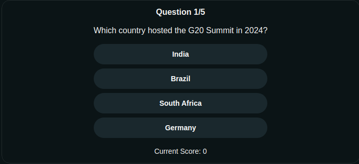

# Trivia Guessing Game

Welcome to **Trivia Guessing Game**! This is a fun and engaging trivia game hosted on [r/RedditHackathonTrivia](https://www.reddit.com/r/RedditHackathonTrivia/). Test your knowledge in a variety of topics including Current Affairs, History, and Sports!

### Game Overview:
- **Rounds:** 5 rounds
- **Points per Round:** 10 points
- **Categories:** 
  - **Current Affairs**
  - **History**
  - **Sports**
- **End of Game:** Your total score is displayed at the end of the game.

---

### How to Play:

1. **Select Your Category:** 
   - Choose from three categories: **Current Affairs**, **History**, or **Sports**.
   
2. **Answer Questions:** 
   - In each round, you will be presented with a trivia question. Choose the correct answer from the options provided.

3. **Earn Points:** 
   - Each correct answer earns you 10 points. Try to get all the questions right to maximize your score!

4. **Complete All Rounds:** 
   - There are 5 rounds in total, each covering different trivia topics. Answer all the questions and check your final score at the end of the game.

---

### Features:
- **Multiple Categories:** Choose the category that suits you best.
- **Scoreboard:** Track your points throughout the game.
- **Fun & Engaging:** Test your knowledge and challenge your friends.

---

### Game Screenshots:

  
_Example of the trivia game in action._

  
_1st question_

  
_2nd question_

  
_3rd question_

  
_4th question_

  
_5th question_

                          
_Your score displayed after completing the game._

---

### How to Participate:
1. Visit my [Reddit page](https://www.reddit.com/r/RedditHackathonTrivia/) for more details and to join the game.
2. Share your score with friends and challenge them to beat it!

---

### Future Updates:
- **More Categories:** Expand the trivia topics to include a wider range of categories.
- **Leaderboard:** Compete with other players and see where you rank.
- **Custom Questions:** Submit your own trivia questions for a chance to be featured in the game.
- **Multiplayer Mode:** Play against friends in real-time trivia challenges.
- **AI Based Questions:** Introduce AI-generated questions for a unique gameplay experience.

---

### Disclaimer:
This game is a fun trivia quiz with a focus on general knowledge and has no affiliation with any external trivia platforms or media outlets.

